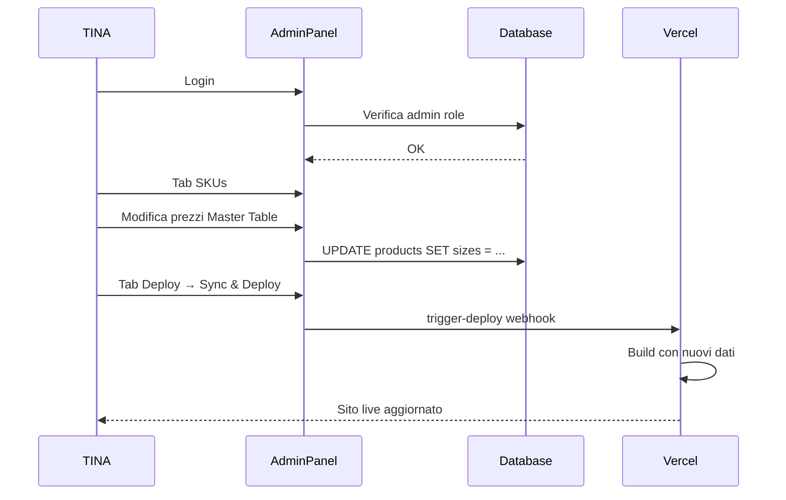

# Admin Journey - TINA (Site Manager)

> Workflow completo per la gestione del sito OctoWonders via AdminPanel.

---

## Diagramma di Flusso

```mermaid
flowchart TD
    subgraph Login["🔐 Autenticazione"]
        A[Apri AdminPanel] --> B{Sessione Attiva?}
        B -->|No| C[Email + Password]
        C --> D[Supabase Auth]
        D --> E{has_role admin?}
        E -->|Sì| F[✅ Dashboard]
        E -->|No| G[❌ Accesso Negato]
        B -->|Sì| F
    end
    
    subgraph Prodotti["📦 Tab Prodotti"]
        F --> P1[Tab Prodotti]
        P1 --> P2[CRUD Prodotti]
        P2 --> P2a[Aggiungi Nuovo]
        P2 --> P2b[Modifica Esistente]
        P2 --> P2c[Elimina con Conferma]
        P1 --> P3[Riordina display_order]
        P1 --> P4[Toggle is_active]
        P1 --> P5[Toggle is_new Badge]
        P1 --> P6[Gestione Tags]
        P1 --> P7[Import/Export]
        P7 --> P7a[JSON Clipboard]
        P7 --> P7b[Excel .xlsx]
        P7 --> P7c[CSV]
        P7 --> P7d[Stripe IDs Bulk]
    end
    
    subgraph SKUs["💰 Tab SKUs"]
        F --> S1[Tab SKUs]
        S1 --> S2[Master Price Table]
        S2 --> S2a[Prezzo per Dimensione]
        S2a --> S2b[Aggiorna Bulk Tutti Prodotti]
        S1 --> S3[Reset a Default]
        S1 --> S4[Gestione Offerte]
        S4 --> S4a[Crea Bulk per Dimensione]
        S4 --> S4b[Rimuovi Tutte]
        S1 --> S5[Export Excel]
        S1 --> S6[Filtro per Dimensione]
    end
    
    subgraph UI["🎨 Tab UI"]
        F --> M1[Tab Menu]
        M1 --> M1a[Voci Navigazione]
        M1a --> M1b[Label + Href + Order]
        M1 --> M1c[Sync con Pagine]
        
        F --> H1[Tab HelloBar]
        H1 --> H1a[Enable/Disable]
        H1 --> H1b[Testo + Colori]
        H1 --> H1c[Countdown]
        H1 --> H1d[Popup Dettagli]
        
        F --> R1[Tab Hero]
        R1 --> R1a[Immagine Upload]
        R1 --> R1b[H1 + Sottotitolo]
        R1 --> R1c[CTA Text]
        R1 --> R1d[Trust Bar Badges]
    end
    
    subgraph Contenuti["📝 Tab Contenuti"]
        F --> C1[Tab Pagine]
        C1 --> C1a[CRUD Pagine]
        C1a --> C1b[Titolo + Slug]
        C1a --> C1c[Content Markdown/HTML]
        C1a --> C1d[SEO Title + Description]
        C1 --> C1e[Nested Slugs]
        C1e --> C1f[blog/articolo-n]
        
        F --> I1[Tab Immagini]
        I1 --> I1a[ArticleImageBrowser]
        I1 --> I1b[ImageOptimizer]
    end
    
    subgraph Deploy["🚀 Tab Deploy"]
        F --> D1[Tab Deploy]
        D1 --> D2[Sync & Deploy]
        D2 --> D3[Edge Function trigger-deploy]
        D3 --> D4[Vercel Webhook]
        D4 --> D5[Build + Deploy]
        D5 --> D6[✅ Sito Live Aggiornato]
    end
    
    style F fill:#9f9,stroke:#333,stroke-width:2px
    style D6 fill:#9f9,stroke:#333,stroke-width:2px
    style G fill:#f99,stroke:#333,stroke-width:2px
```



---

## Accesso AdminPanel

### Autenticazione

**Metodo:** Supabase Auth (email/password)

**Verifica ruolo:**
```sql
-- Funzione database
SELECT has_role(auth.uid(), 'admin');
```

**Tabella user_roles:**
```sql
CREATE TABLE user_roles (
  id UUID PRIMARY KEY,
  user_id UUID REFERENCES auth.users,
  role app_role  -- 'admin' | 'user'
);
```

**Setup iniziale admin:**
- Edge function `setup-admin` crea primo utente admin
- Richiede secrets `ADMIN_EMAIL` + `ADMIN_PASSWORD`

---

## Tab AdminPanel

### Tab 1: Prodotti

**Componente:** `AdminPanel.tsx` (sezione prodotti)

#### Azioni CRUD

| Azione | Descrizione | Conferma |
|--------|-------------|----------|
| Aggiungi | Nuovo prodotto vuoto | No |
| Modifica | Inline editing campi | Auto-save |
| Elimina | Rimuove prodotto | Dialog conferma |

#### Campi Prodotto

| Campo | Tipo | Note |
|-------|------|------|
| `name` | string | Nome opera |
| `slug` | string | URL-friendly, auto-generato |
| `medium` | string | Tecnica artistica |
| `image_url` | string | URL immagine principale |
| `description` | text | Descrizione HTML/Markdown |
| `is_active` | boolean | Visibilità pubblica |
| `is_new` | boolean | Badge NEW |
| `display_order` | number | Ordinamento galleria |
| `tags` | string[] | Per opere correlate |

#### Gestione Sizes

Ogni prodotto ha array `sizes`:
```typescript
interface ProductSize {
  dimensions: string;      // "80x120"
  price: number;           // €129
  stripe_product_id: string; // "prod_xxx"
  mock_room_url?: string;  // URL immagine mock room
  mock_room_label?: string; // Label custom (es. "Grande")
}
```

**Regola SKU:** `80x120` = `120x80` (stesso SKU, dimensioni invertite equivalenti)

#### Gestione Offerte (per size)

| Campo | Descrizione |
|-------|-------------|
| `deal_label_enabled` | Abilita offerta |
| `deal_price` | Prezzo scontato |
| `deal_label_text` | Testo badge (es. "OFFERTA -20%") |

#### Ordinamento

- **Move Up/Down**: Cambia `display_order`
- Ordinamento persiste in database
- Riflesso immediato in galleria frontend

#### Import/Export

**JSON (Clipboard):**
```json
[
  {
    "id": "uuid",
    "name": "Opera 1",
    "sizes": [...],
    ...
  }
]
```
- Export: Copia in clipboard
- Import: Merge/Add only (no delete)
- Match per UUID `id`

**Excel (.xlsx):**
- Export con libreria `xlsx`
- Colonne: Name, Slug, Medium, Sizes (JSON), etc.

**CSV:**
- Import con parser custom
- Merge con prodotti esistenti

**Stripe IDs Bulk:**
```json
{
  "prod_abc123": ["Opera 1", "Opera 2"],
  "prod_def456": ["Opera 3"]
}
```
- Assegna stesso Stripe Product ID a più opere

#### Migrazione Immagini

- Da URL locale/esterno → Supabase Storage
- Bucket: `product-images`
- Auto-update `image_url` dopo upload

---

### Tab 2: SKUs (SKUEditor)

**Componente:** `SKUEditor.tsx`

#### Logica Dimensioni

**Normalizzazione:**
```typescript
function normalizeDimension(dim: string): string {
  const [a, b] = dim.split('x').map(Number);
  return `${Math.min(a, b)}x${Math.max(a, b)}`;
}
// "120x80" → "80x120"
// "80x120" → "80x120"
```

**Applicazione:** Checkout, mock room matching, SKU grouping

#### Master Price Table

Tabella con prezzo unico per dimensione:

```
┌─────────────┬───────────┬─────────────┐
│ Dimensione  │ Prezzo €  │ Azione      │
├─────────────┼───────────┼─────────────┤
│ 40x40       │ 44        │ [Modifica]  │
│ 60x40       │ 53        │ [Modifica]  │
│ 60x60       │ 70        │ [Modifica]  │
│ 80x60       │ 71        │ [Modifica]  │
│ 80x80       │ 95        │ [Modifica]  │
│ 90x60       │ 99        │ [Modifica]  │
│ 100x75      │ 112       │ [Modifica]  │
│ 120x80      │ 129       │ [Modifica]  │
└─────────────┴───────────┴─────────────┘
```

**Bulk Update:**
1. Modifica prezzo per dimensione
2. Click "Salva"
3. Aggiorna TUTTI i prodotti con quella dimensione

#### Default Prices

**Tabella database:** `default_prices`
```sql
CREATE TABLE default_prices (
  id UUID PRIMARY KEY,
  dimensions VARCHAR NOT NULL UNIQUE,
  price DECIMAL NOT NULL
);
```

**Reset a Default:**
- Ripristina tutti i prezzi ai valori in `default_prices`
- Utile dopo esperimenti pricing

#### Gestione Offerte Bulk

**Crea Offerte:**
1. Click "Crea Offerte"
2. Inserisci prezzo offerta per ogni dimensione
3. Inserisci testo label (es. "OFFERTA NATALE")
4. Click "Applica"
5. Tutti i prodotti con quelle dimensioni ricevono offerta

**Rimuovi Offerte:**
- Click "Rimuovi Tutte"
- Disabilita `deal_label_enabled` per tutti i sizes

#### Export Excel

Colonne export:
| Colonna | Descrizione |
|---------|-------------|
| Size | Dimensione normalizzata |
| Price € | Prezzo corrente |
| Product Name | Nome opera |
| Stripe ID | stripe_product_id |

#### Filtro Dimensione

- Dropdown per selezionare dimensione specifica
- Mostra solo prodotti con quella dimensione
- Utile per verifiche/modifiche mirate

---

### Tab 3: Menu

**Componente:** `MenuTabContent.tsx`

#### Gestione Voci

| Campo | Descrizione |
|-------|-------------|
| `label` | Testo visibile |
| `href` | URL destinazione |
| `order` | Posizione (1, 2, 3...) |

#### Azioni

- **Aggiungi**: Nuova voce menu
- **Modifica**: Inline edit label/href
- **Rimuovi**: Elimina voce
- **Riordina**: Move up/down
- **Carica Defaults**: Ripristina menu predefinito

#### Sync con Pagine

Quando una pagina viene rinominata (cambio slug):
1. Trova voce menu con `href` = vecchio slug
2. Aggiorna `href` a nuovo slug
3. Opzionale: aggiorna `label`

---

### Tab 4: HelloBar

**Componente:** `HelloBarTabContent.tsx`

#### Sezioni Configurabili

**Generale:**
- Enable/Disable HelloBar

**Testo:**
| Campo | Descrizione |
|-------|-------------|
| `content` | Testo HTML |
| `text_color` | Colore testo (HEX) |
| `bg_color` | Colore sfondo (HEX) |
| `opacity` | Trasparenza (0-1) |

**Countdown:**
| Campo | Descrizione |
|-------|-------------|
| `enabled` | Mostra countdown |
| `end_date` | Data/ora fine |
| `text_color` | Colore numeri |
| `bg_color` | Sfondo timer |

**Bottone Dettagli:**
| Campo | Descrizione |
|-------|-------------|
| `enabled` | Mostra bottone |
| `text` | Testo bottone |
| `text_color` | Colore testo |
| `bg_color` | Sfondo bottone |
| `border_color` | Bordo bottone |

**Popup:**
| Campo | Descrizione |
|-------|-------------|
| `content` | Contenuto popup (textarea) |
| `whatsapp_number` | Numero per contatto |
| `email` | Email per contatto |

---

### Tab 5: Hero

**Componente:** (sezione in AdminPanel)

#### Campi Configurabili

| Campo | Descrizione | Raccomandazioni |
|-------|-------------|-----------------|
| `image_url` | Immagine Hero | WebP, 1920×1080 |
| `title` | H1 principale | Max 60 char SEO |
| `subtitle` | Sottotitolo | Max 160 char |
| `cta_text` | Testo bottone | Es. "Esplora la Collezione" |

#### Trust Bar

Lista badge modificabili:
```json
[
  "🚚 Spedizione Gratuita",
  "🔒 Pagamento Sicuro", 
  "🎨 Arte Originale",
  "📦 Reso Facile"
]
```

---

### Tab 6: Pagine

**Componente:** `PagesTabContent.tsx`

#### CRUD Pagine

**Crea Nuova:**
1. Inserisci titolo
2. Slug auto-generato (modificabile)
3. Seleziona content_type (markdown/html)
4. Salva

**Modifica:**
- Inline editing per tutti i campi
- Auto-save su blur

**Preview:**
- Apre pagina in nuova tab

**Elimina:**
- Dialog conferma
- Rimuove anche voce menu correlata

#### Content Types

| Tipo | Editor | Rendering |
|------|--------|-----------|
| `markdown` | Textarea con syntax | Convertito in HTML |
| `html` | Textarea raw | Renderizzato diretto |

**Supporto misto:**
```markdown
## Titolo Markdown

Testo normale con **grassetto**.

<span style="color: #e34234;">Testo rosso HTML</span>
```

#### Upload Immagini

Per contenuto Markdown:
1. Click "Carica Immagine"
2. Seleziona file
3. Upload a Supabase Storage (`article-images`)
4. URL inserito nel contenuto

#### SEO Fields

| Campo | Max Chars | Descrizione |
|-------|-----------|-------------|
| `seo_title` | 60 | Title tag pagina |
| `seo_description` | 160 | Meta description |

#### Nested Slugs

Supporto struttura gerarchica:
```
/blog              → Pagina container
/blog/articolo-1   → Nested page
/blog/articolo-2   → Nested page
```

**Routing:** `NestedCMSPage.tsx` per path con `/`

---

### Tab 7: Immagini

#### ArticleImageBrowser

**Componente:** `ArticleImageBrowser.tsx`

- Libreria immagini per articoli/pagine
- Browse bucket `article-images`
- Upload nuove immagini
- Copia URL per inserimento in contenuto

#### ImageOptimizer

**Componente:** `ImageOptimizer.tsx`

- Ottimizzazione immagini prodotti
- Resize automatico
- Conversione WebP
- Upload a `product-images`

---

### Tab 8: Deploy

#### Sync & Deploy

**Flusso:**
1. Click "Sync & Deploy"
2. Invoca edge function `trigger-deploy`
3. Edge function chiama Vercel Deploy Hook
4. Vercel avvia build
5. Build rigenera dati statici (products.json, pages.json)
6. Deploy nuovo bundle
7. Sito live aggiornato (1-2 minuti)

**Edge Function:** `trigger-deploy`
```typescript
// Chiama VERCEL_DEPLOY_HOOK secret
await fetch(Deno.env.get('VERCEL_DEPLOY_HOOK'), {
  method: 'POST'
});
```

---

## Flusso Tipico TINA

### Cambio Prezzi Giornaliero



### Creazione Offerta Flash

1. Login AdminPanel
2. Tab SKUs
3. Click "Crea Offerte"
4. Inserisci prezzi offerta per dimensioni target
5. Inserisci label "FLASH SALE -30%"
6. Click "Applica"
7. Tab HelloBar → Abilita countdown con end date
8. Tab Deploy → Sync & Deploy
9. Verifica live

### Aggiunta Nuovo Prodotto

1. Login AdminPanel
2. Tab Prodotti
3. Click "Aggiungi Nuovo"
4. Compila campi (nome, medium, descrizione)
5. Upload immagine principale
6. Aggiungi sizes con prezzi
7. Vai su Stripe Dashboard → Crea Product
8. Copia Stripe Product ID
9. Incolla in ogni size del prodotto
10. Toggle `is_active` = true
11. Opzionale: Toggle `is_new` = true
12. Tab Deploy → Sync & Deploy

---

## Visualizzazione Diagramma

### GitHub
Il diagramma Mermaid viene renderizzato automaticamente.

### VS Code
Installa estensione: **"Markdown Preview Mermaid Support"**

### Figma (Export)
1. Vai a [mermaid.live](https://mermaid.live)
2. Incolla il codice Mermaid
3. Esporta come PNG o SVG
4. Importa in Figma

---

## Reference Codebase

| Componente | File |
|------------|------|
| AdminPanel | `src/components/AdminPanel.tsx` |
| SKU Editor | `src/components/SKUEditor.tsx` |
| Menu Tab | `src/components/MenuTabContent.tsx` |
| HelloBar Tab | `src/components/HelloBarTabContent.tsx` |
| Pages Tab | `src/components/PagesTabContent.tsx` |
| Image Browser | `src/components/ArticleImageBrowser.tsx` |
| Image Optimizer | `src/components/ImageOptimizer.tsx` |
| Setup Admin | `supabase/functions/setup-admin/index.ts` |
| Trigger Deploy | `supabase/functions/trigger-deploy/index.ts` |

---

## Secrets Richiesti

| Secret | Utilizzo |
|--------|----------|
| `ADMIN_EMAIL` | Email primo admin |
| `ADMIN_PASSWORD` | Password primo admin |
| `VERCEL_DEPLOY_HOOK` | Webhook per deploy |
| `STRIPE_SECRET_KEY` | API Stripe per checkout |
